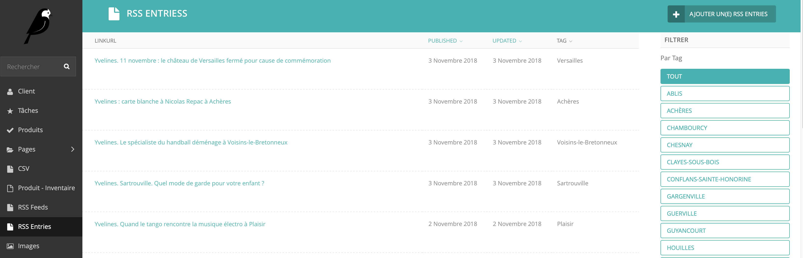
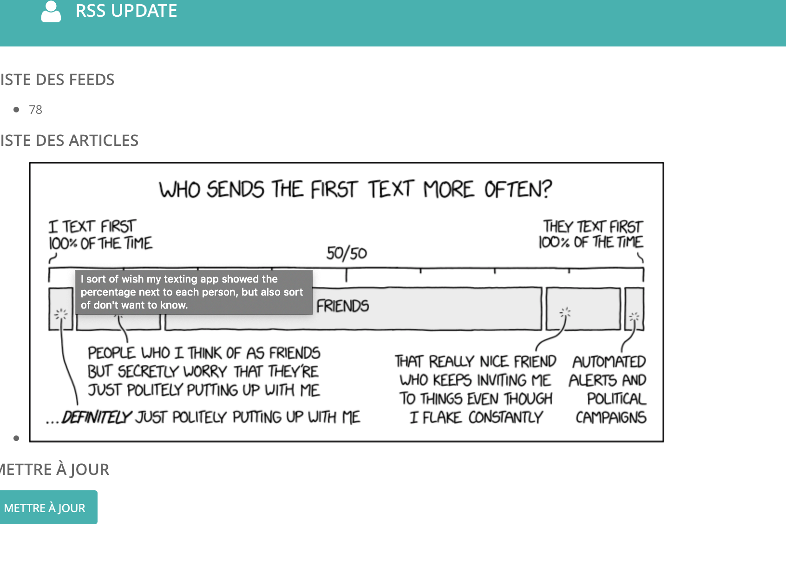

# snotra_rss
Wagtail extension for add RSS aggregator feature

## Big news
Now full support Fever API !
Please configure your account in Feed account


New in 0.2 twitter aggregator
and now on pypi just install snotra-rss with pip


## Capture






## installation
add the following line to your requirements.txt file :
````
snotra-rss
````

after that add snotra_rss to INSTALLED_APPS section of your wagtail settings:
````
INSTALLED_APPS = [
    'home',
    'snotra_rss',
    'corbeille',
    'search',
    'wagtail.contrib.forms',
    'wagtail.contrib.redirects',
    'wagtail.embeds',
    'wagtail.sites',
    'wagtail.users',
    'wagtail.snippets',
    'wagtail.documents',
    'wagtail.images',
    'wagtail.search',
    'wagtail.contrib.modeladmin',
    'wagtail.contrib.table_block', # ajout support des tableaux
    'wagtail.core',
    'wagtail.admin',
    'modelcluster',
    'wagtail.contrib.styleguide',
    'taggit',
    'wagtail.contrib.postgres_search',
    'django.contrib.admin',
    'django.contrib.auth',
    'django.contrib.contenttypes',
    'django.contrib.sessions',
    'django.contrib.messages',
    'django.contrib.staticfiles'
]
````

after that add urls of snotra_rss to your urls section of your wagtail apps

````
from snotra_rss import urls as snotra_urls


urlpatterns = [
    url(r'^django-admin/', admin.site.urls),

    url(r'^admin/', include(wagtailadmin_urls)),
    url(r'^documents/', include(wagtaildocs_urls)),

    url(r'^search/$', search_views.search, name='search'),

    # For anything not caught by a more specific rule above, hand over to
    # Wagtail's page serving mechanism. This should be the last pattern in
    # the list:
    url(r'', include(wagtail_urls)),
    url(r'', include(snotra_urls))

    # Alternatively, if you want Wagtail pages to be served from a subpath
    # of your site, rather than the site root:
    #    url(r'^pages/', include(wagtail_urls)),
]
````

## Usage
1. First create feeds in your admin section, you should see Rss feeds section
2. after that, go to your app url /update uri
3. entries is updated, you can see them in the rss entries section

good usage


# Release note
 - 0.2.3.2
   * Add datalog support
 - 0.2.3.1
   * change logging mode for request
 - 0.2.2 and 0.2.3
   * Add twitter hashtag followup
     - You can add hashtag in RSS feed in the name field (don't forget to check the twit box)
 
 - 0.2.1
   * Add twitter followup for person
     - You can add twitter person in RSS feed in the name field (don't forget to check the name field)