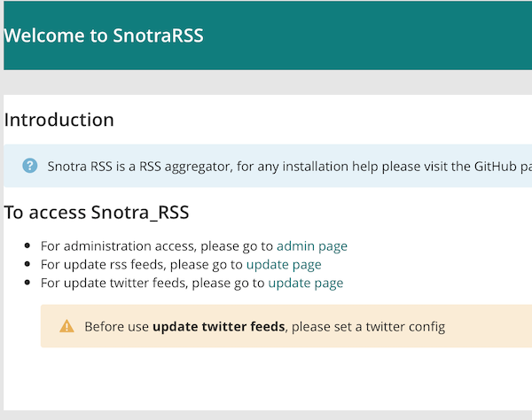

# snotra_rss
[](https://github.com/olopost/snotra_rss/issues)
[](https://github.com/olopost/snotra_rss/network)
[](https://github.com/olopost/snotra_rss/stargazers)
[](https://github.com/olopost/snotra_rss/blob/master/LICENSE)
[](https://twitter.com/intent/tweet?text=Wow:&url=https%3A%2F%2Fgithub.com%2Folopost%2Fsnotra_rss)
## Overview
 - Self hosted rss feed agregator based on wagtail cms.
 - Self hosted twitter feed agregator based on wagtail cms.

This is a [Wagtail](https://wagtail.io) extension adding RSS aggregator feature and [Twitter](https://twitter.com) aggregator


## Big news
Now full support Fever API !
Please configure your account in Feed account


New in 0.2 twitter aggregator
and now on pypi just install snotra-rss with pip


## Capture


## Test with docker
 - build docker images with
 ```shell script
# in snotra rss directory, type :
docker build -t snotra .
# run image with
docker run -p 8000:8000 --rm snotra
```
 - next open a browser and navigate to http://localhost:8000
 

## Install
add the following line to your requirements.txt file :
````
snotra-rss
````

after that add snotra_rss to INSTALLED_APPS section of your wagtail settings:
please also add taggit if not already done
````
INSTALLED_APPS = [
    'taggit',
    'snotra_rss',
    'corbeille',
    'search',
    'wagtail.contrib.forms',
    'wagtail.contrib.redirects',
    'wagtail.embeds',
    'wagtail.sites',
    'wagtail.users',
    'wagtail.snippets',
    'wagtail.documents',
    'wagtail.images',
    'wagtail.search',
    'wagtail.contrib.modeladmin',
    'wagtail.contrib.table_block', # ajout support des tableaux
    'wagtail.core',
    'wagtail.admin',
    'modelcluster',
    'wagtail.contrib.styleguide',
    'wagtail.contrib.postgres_search',
    'django.contrib.admin',
    'django.contrib.auth',
    'django.contrib.contenttypes',
    'django.contrib.sessions',
    'django.contrib.messages',
    'django.contrib.staticfiles'
]
````

after that add urls of snotra_rss to your urls section of your wagtail apps

````
from snotra_rss import urls as snotra_urls


urlpatterns = [
    url(r'^django-admin/', admin.site.urls),

    url(r'^admin/', include(wagtailadmin_urls)),
    url(r'^documents/', include(wagtaildocs_urls)),

    url(r'^search/$', search_views.search, name='search'),

    # For anything not caught by a more specific rule above, hand over to
    # Wagtail's page serving mechanism. This should be the last pattern in
    # the list:
    url(r'', include(wagtail_urls)),
    url(r'', include(snotra_urls))

    # Alternatively, if you want Wagtail pages to be served from a subpath
    # of your site, rather than the site root:
    #    url(r'^pages/', include(wagtail_urls)),
]
````

## Usage
1. First create feeds in your admin section, you should see Rss feeds section
2. after that, go to your app url /update uri
3. entries is updated, you can see them in the rss entries section

good usage


# Release note
 - 0.2.5.0
    * fix bug for url string too long (more than 200 characters)
    * add refresh entries button to menu bar
 - 0.2.4.0
   * Refactor organisation and add a homepage if use standalone
 - 0.2.3.9
   * correct last refresh bug
 - 0.2.3.8
   * Optimisation / last refresh (block is refresh take less than 2 minutes)
 - 0.2.3.7
   * bug correction - mark all as read
 - 0.2.3.6
   * Improvement in tweet display
 - 0.2.3.5
   * Add some client_ip tracking
 - 0.2.3.4
   * Externalize the log handler for OVH  Logs Data Platform in a new project : [Pygelf4OVH - Github project](https://github.com/olopost/pygelf4ovh.git)
   * Thanks to : Ivan Mukhin for PyGelf [PyGelf GitHub project](https://github.com/keeprocking/pygelf)
 - 0.2.3.3
   * review logging policy and adapt them for graylog
   * OVH Data log compatible
 - 0.2.3.2
   * Add datalog support
 - 0.2.3.1
   * change logging mode for request
 - 0.2.2 and 0.2.3
   * Add twitter hashtag followup
     - You can add hashtag in RSS feed in the name field (don't forget to check the twit box)
 
 - 0.2.1
   * Add twitter followup for person
     - You can add twitter person in RSS feed in the name field (don't forget to check the name field)
     

## Thanks
- thanks to [Torchbox](https://www.torchbox.com) for wagtail cms application